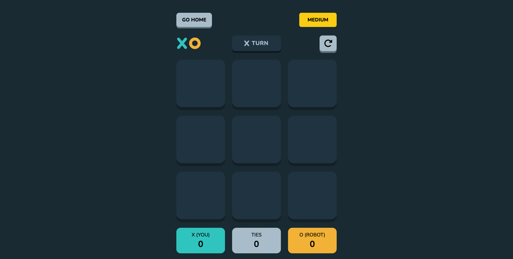

# TIC TAC TOE GAME

## Table of Contents

- [Overview](#overview)
  - [Project Description](#project-description)
  - [Screenshot](#screenshot)
  - [Solution URL](#solution-url)
- [My Process](#my-process)
  - [Built With](#built-with)
  - [What I Learned](#what-i-learned)
  - [Continued Development](#continued-development)
  - [Useful Resources](#useful-resources)

## Overview

### Project Description

A web version of the popular tic-tac-toe game, featuring two modes: human vs human and human vs computer. In human vs human mode, players are able to:
- Choose their own icons (x always goes first)
- Input their names to be displayed on the scoreboard
In the human vs computer mode, the single player is able to:
- Choose their own icon (x always goes first)
- Select a difficulty level from easy, medium and impossible

### Screenshot

### Solution URL

### My Process

### Built With

- Semantic HTML5 markup
- CSS custom properties
- Flexbox
- CSS Grid
- Mobile-first workflow
- [React](https://reactjs.org/) - JS library
- [tailwindCSS](https://tailwindcss.com/) - CSS library
- [framer-motion](https://www.framer.com/motion/) - Animation library
- [fontawesome](https://fontawesome.com/) - Icon library

### What I learned

I learned a boatload of things from this project. I improved my CSS layout skills, learned the difference between shallow copying and deep copying, and most importantly, learned how to program a minimax algorithm to determine the best move for an AI to make in a game. This algorithm was quite tough to implement – as I had to learn about game trees, recursion, and a bunch of other things – but I am proud to say I was able to figure it out.

### Continued Development

I plan to take a more organized approach to completing future projects. One of the challenges I faced in completing this project was the need to restructure the entire codebase whenever I wanted to add new features. To address this issue in future projects, I will ensure that I develop a solid outline detailing all the necessary steps before I begin coding.

### Useful Resources

- [Minimax Algorithm for Tic Tac Toe](https://youtu.be/trKjYdBASyQ?si=_lHsyuTM942q6BAS)
- [Minimax: How Computers Play Games](https://youtu.be/SLgZhpDsrfc?si=lF_QcJiy4Fc66Dwb)
- [Geeks for Geeks - Minimax Algorithm in Game Theory](https://www.geeksforgeeks.org/minimax-algorithm-in-game-theory-set-1-introduction/)
